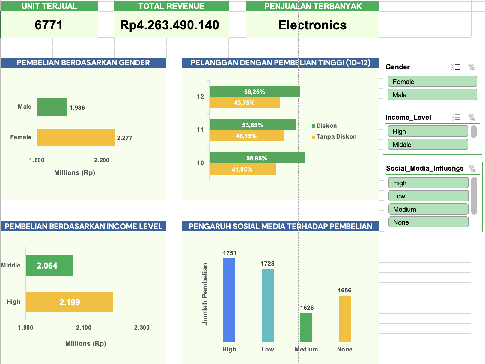

# Surya Mart Business Analysis

## 1. Business Problem
SuryaMart is a multi-category e-commerce company seeking to evaluate the effectiveness of its digital marketing campaigns. This project analyzes customer purchase behavior to help optimize future marketing strategies and improve overall campaign performance.

- **Dataset:** A dataset of 1,000+ SuryaMart customer transactions containing demographic, purchasing, and marketing-related attributes, including Customer_ID, Age, Gender, Income_Level, Location, Purchase_Category, Purchase_Amount, Frequency_of_Purchase, Social_Media_Influence, and Discount_Used, used to analyze customer behavior and marketing campaign effectiveness.
- **Tools:** Microsoft Excel, Excel

## 3. Key Findings
1. Female customers contribute a higher total purchase amount than male customers.
2. High-income customers generate the largest share of total purchases.
3. Electronics is the best-selling product category.
4. Bandung has the most active customers based on purchase frequency.
5. Frequent shoppers are more likely to use discounts, indicating strong responsiveness to promotions.
6. Social media positively influences purchase amounts among highly engaged customers.
7. However, over 50% of purchases come from customers with low or no social media engagement, suggesting other marketing channels remain highly effective.
8. There is an opportunity to improve the conversion of medium-engagement social media audiences into active buyers.

## 4. Business Recommendations
1. Target high-value customers by focusing digital campaigns on female and high-income segments while offering exclusive loyalty programs and personalized premium product recommendations.
2. Maximize Electronics sales by ensuring product availability, expanding best-selling SKUs, and implementing cross-selling and installment payment options.
3. Strengthen customer engagement in Bandung through localized campaigns, community events, and faster delivery services to retain the most active customer base.
4. Leverage discount-driven behavior by launching personalized flash sales and gamified promotions for frequent shoppers to increase repeat purchases.
5. Optimize marketing channels by scaling high-performing social media campaigns while improving the conversion of medium-engagement audiences through targeted content and promotional offers.

## 5. Dashboard

---
**Author:** Alfian Afriansyah · alfianafriansyah@gmail.com

